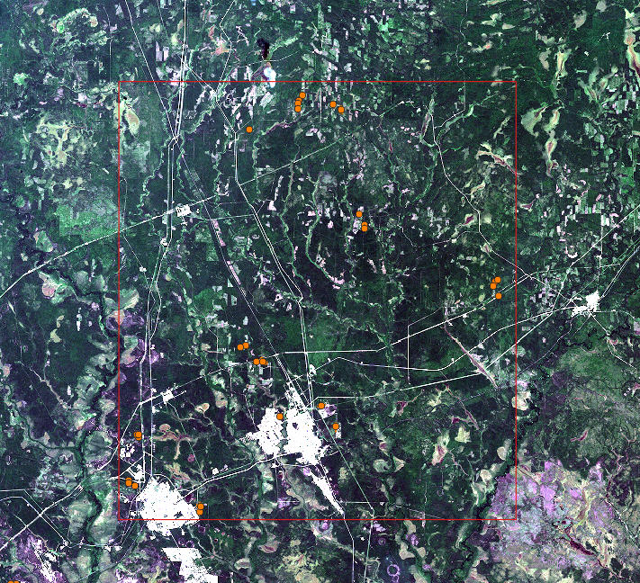

# Модель прогноза лесных рубок по разновременным космоснимкам

Исследование проведено в два этапа. На первом этапе определялась относительное изменение значений спектральных каналов Sentinel-2 вследствие проведения вырубки леса. На втором этапе дана оценка результатов машинного обучения при различных исследовательских сценариях.

**1 этап. Анализ влияния рубок на средние значения каналов**

Для исследования подготовлена выборка данных на основе 29 рубок, произошедших в период между двумя снимками Sentinel-2, с датами съемки 12.07.2017 и 21.08.2017. Использовано по 9 каналов от каждого снимка: B02, B03, B04, B05, B06, B07, B8A, B11, B12. Использованы 20 и 10 метровые каналы, разрешение 10 метровых каналов (B02, B03, B04) приведено к 20 метрам.
Для ускорения процессов обработки на снимках выделен тестовый участок с наибольшей концентрацией рубок. Расположение тестового участка (красные линии) и рубок (оранжевые точки) показано на рисунке. В границах тестового участка из снимков извлечены центры пикселей каналов и сохранены в виде точек, содержащих значения спектральной яркости пикселей. Точки, попадающие в границы рубок, были помечены в поле felling значением «1», не попадающие – «0». Всего получилось 3 382 932 точки, из которых 3594 относятся к рубкам.

**2 этап. Построение модели прогнозирования рубок**

Анализ влияния каналов на прогноз рубки предлагается провести с использованием модели машинного обучения случайного леса (Random Forest). На вход модели подаются размеченные данные двух снимков, где целевой признак — наличие рубки. Модель присваивает признакам (каналам снимков) весовые коэффициенты, обозначающие влияние признака на прогноз наличия рубки. Точность прогноза модели оценивается с использованием стандартных метрик: Precision, Recall, F1-score. 
Метрики, получаемые при анализе исходного датасета, имеют метку Producer. Для получения более точных оценок, подготовлен второй датасет, на основе другой пары снимков с 30 рубками, произошедшими в период с 11.07.2017 по 25.08.2017, содержащий 2 058 588 точек. Для второго датасета строится прогноз моделью, обученной по первому датасету и строятся метрики. Метрики второго датасета имеют метку User.

Подготовлено 5 исследовательских сценариев, в рамках которых на вход модели подаются разные комбинации каналов и дополнительных данных, которые могут влиять на точность прогноза. Результаты оцениваются с помощью сравнения метрик, затраченного на обработку времени и весовых коэффициентов модели.

|Сценарий |	Комбинации данных |	Признаки |
| :--------: | :--------: | :--------: |
|1	| Все каналы Sentinel-2	| 'B02', 'B03', 'B04', 'B05', 'B06', 'B07', 'B8A', 'B11', 'B12' |
|2	| Sentinel-2 без малоинформативных каналов по результатам 1 этапа |	'B02', 'B03', 'B04', 'B05', 'B11', 'B12' |
|3	| По 3 каналам с наибольшим весом по результатам 1 сценария |	'B02', 'B03', 'B11'|
|4	| Sentinel-2 c индексами NBR и NDVI |	'B02', 'B03', 'B04', 'B05', 'B11', 'B12', 'NBR', 'NDVI' |
|5	| Sentinel-2 и Sentinel-1 |	'B02', 'B03', 'B04', 'B05', 'B11', 'B12', 'VV', 'VH' |

Для выполнения сценария 4 подготовлены дополнительные данные в виде индексов гарей и растительности, построенных с использованием каналов исходных снимков Sentinel-2. Для сценария 5 подготовлен снимок Sentinel-1 за 25.08.2017, из которого извлечены значения пикселей каналов 'VV' и 'VH'.